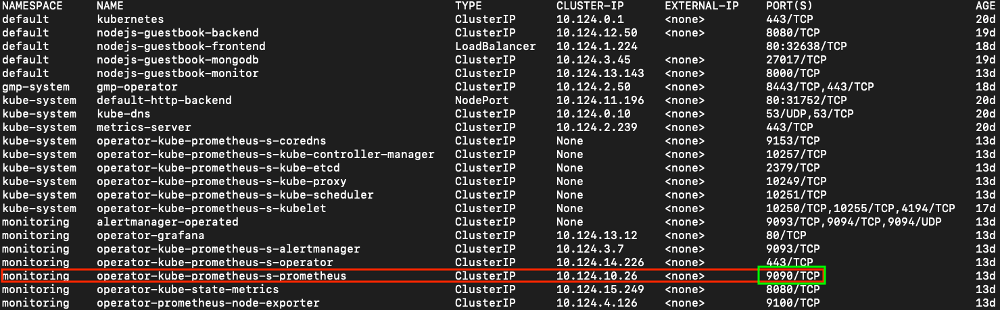
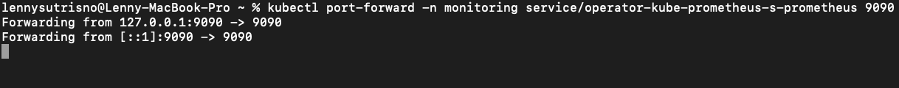

<!--  -->
<p align="center">
  
</p>

# Palaemon :fried_shrimp:

- An Electron based developer tool for Kubernetes cluster monitoring and error analysis
- Palaemon is a Greek, child sea-god who came to aid sailors in distress. He was often depicted as riding a dolphin. Also, a genus of [shrimp](https://en.wikipedia.org/wiki/Palaemon_(crustacean)).

# Running the Electron App
Prerequisites:
- [ ] kubectl installed
- [ ] Prometheus installed
- [ ] Prometheus port-forwarded to `localhost:9090`

## Launching in dev mode with Hot-Module Reload (HMR)
If this is the first time launching the app then run the following commands:
```
npm install
npm run build
```
This will build your initial `dist` folder.

<!-- If this it the first time running the app, start by `npm run build` to build your initial `dist` folder.  -->
Then on a different terminal run 
```
npm run electronmon
```

The build command for webpack will run webpack with the --watch flag to watch for any changes in the files, and rebuild the dist folder when any files are changed. Electronmon is watching the dist folder for any changes and will either refresh or relaunch the electron app when it detects any of the dist folder files have been changed.


## After the initial build, you can now run the following command
```
npm start
``` 
This which will first delete the old `dist` folder from your app, and concurrently launch the webpack to build and electronmon to wait for the new `dist` folder to be built.

If the build process was interrupted through `CTRL + C` or other means, then you may receive the following error:
```
Error: ENOENT: no such file or directory, stat 'dist'
```
In this case, just run the command below, and wait for webpack to finish building. After webpack has finished, you can start the app normally.
```
npm run build
```
## Launching in production mode:
The command below will build and bundle files into /dist folder for production and open the electron app based on the bundled files from /dist. 
```
npm start:production
``` 

# Using Palaemon
1. On a successful startup, you will be greeted with a landing page allowing you to select a namespace to be analyzed.
2. After selecting your namespace, you will be moved to the home page
    - The home page is where you can find a list of all events, alerts, and OOMKills
    - Events are limited to occurences within the last hour due to a kubectl limitation.
    - OOMKill events are **not** limited to the last hour.
3. The lefthand side will show you all of your pods within the namespace. 
    - The color of the squares represent the memory usage vs memory limit of the pod, with green pods using less memory than their requested amount.
    - Black pods indicate that no data was available for that pod.
4. When the OOMKill type is seleceted, an `Analyze` button will appear, where you can click that to be taken to the `Analysis` page.
    - Here is where you can find all of the information on your node and other pods at the time of death, along with pertinent events.
  

# Kubernetes Requirements
Palaemon utilizes the kubernetes command line tool (kubectl) to gather data on your nodes and clusters. Kubectl can be downloaded and installed [here](https://kubernetes.io/docs/tasks/tools/).

Minikube can also be used to test out Palaemon. More can be found on their official documentation [here](https://minikube.sigs.k8s.io/docs/start/).

Palaemon has not yet been tested with Amazon Elastic Kubernetes Service (EKS) or Microsoft Azure Kubernetes Service (AKS), but should be compatible provided that kubectl can access all cluster and node information.
## How to Connect to Google Kubernetes Engine

1. Install gcloud CLI on your local machine from [here](https://cloud.google.com/sdk/docs/install)
  - If you have having problems with the gcloud CLI, try using the command below in your home directory, and make sure to update your $PATH in the process.
```
curl https://sdk.cloud.google.com | bash
```
  - If you are still having issues, trying restarting your terminal.
2. Initialize the gcloud CLI following the steps [here](https://cloud.google.com/sdk/docs/initializing)
3. Connect your gcloud CLI to your GKE cluster [here](https://cloud.google.com/kubernetes-engine/docs/how-to/cluster-access-for-kubectl)
  - Make sure to get the credentials of your cluster (see below) or you will not be able to connect to your cluster
  ```
  gcloud container clusters get-credentials [CLUSTER_NAME]
  ```

# Prometheus Requirements
Palaemon utilizes Prometheus to scrape for data on your pods. Therefore, please ensure you have Prometheus installed on your node.

Cloud hosting platforms such as GCP and AWS already have managed Prometheus services. If you are new to Prometheus, we recommend installing the Prometheus monitoring package, Prometheus Operator. This includes a full monitoring stack: Prometheus, Alert Manager, Node Exporter, Grafana, and Kube State Metrics. Prometheus Operator can be installed onto your cluster via Helm at the link [here](https://artifacthub.io/packages/helm/choerodon/prometheus-operator).

Once you have Prometheus installed into your Kubernetes cluster, follow the steps below to port-forward your Prometheus operator service.

## Connecting Prometheus to Palaemon

 Make sure a Prometheus pod is installed onto your node/cluster, and forward its port (default 9090) to your localhost through the command below.
```
kubectl port-forward -n [NAMESPACE] service/[PROMETHEUS] 9090
```

  - The -n flag indicates the namespace that the pod is assigned to.
  - A list of all available services can be found through typing the command below in the terminal.
```
kubectl get services -A
```
 Find the service with a 9090/TCP Port assigned, and forward that service to your local 9090.



In the example above, the command would be :
```
kubectl port-forward -n monitoring service/operator-kube-prometheus-s-prometheus 9090
```

Once you have port-forwarded the service, you should now be able to access the Palaemon application. If you are still getting an error with port 9090 being closed, double-check that you are exposing the correct service: It should be listening on port 9090 (see picture below).

 - A more detailed set of instructions can be found on Google's Documentations [here](https://cloud.google.com/stackdriver/docs/managed-prometheus/query)

 

 ### NOTE: While you *can* forward Prometheus to a local port that is **not** 9090, Palaemon is not yet setup to handle any other port besides 9090.

<br></br>
## How to Run Tests
### Unit and Integration tests using Jest
The jest testing suite will start with the command below. The `--watch` flag is enabled, which allows for immediate retests upon save. The jest config in `jest.config.js` is set up to only look for and run test files within the `__test__` folder and with file names that include ".test." in them, such as "Events.test.tsx". 
```
npm run test:watch
```
Units tests are set up using Jest testing suite and react-testing-library to test react components in the front end. 

### End-to-End testing with Playwright Test Runner
`npm run test:e2e` will execute the playwright test runner and run any test files in the `__test__` folder with the name format ".e2e." in them, such as "playwright.e2e.ts". 

There are settings to enable HTML report and video, snapshot, trace recordings that can be configured in the `playwright.config.ts` file is fo desired. 


## Features

* Realtime Pod memory usage, sorted by namespaces

## Planned Features

1. Provide custom alerts for OOMKill events with specific termination reasons such as “Limit Overcommit” or “Container Limit Reached”
2. Allow for early, graceful termination of pods
3. Automatic reconfiguration of YAML files to adjust memory limits and requests

## Built With


- [Electron](https://www.electronjs.org/)
- [TypeScript](https://www.typescriptlang.org/)
- [React](https://reactjs.org/)
- [React Router](https://reactrouter.com/)
- [Jest](https://jestjs.io/)
- [Playwright](https://playwright.dev/)
- [Node](https://nodejs.org/)
- [Prometheus](https://prometheus.io/)
- [Chart.js](https://www.chartjs.org/)
<!-- - [Kubernetes-client](https://github.com/kubernetes-client/) -->

## The Team
- Si Young Mah [Github](https://github.com/siyoungmah) [LinkedIn](https://www.linkedin.com/in/siyoungmah/)
- Patrick Hu [Github](https://github.com/pathu91) [LinkedIn](https://www.linkedin.com/in/patrickhu91/)
- Thang Thai [Github](https://github.com/thang-thai) [LinkedIn](https://www.linkedin.com/in/thang-thai/)
- Raivyno Lenny Sutrisno [Github](https://github.com/FrozenStove) [LinkedIn](https://www.linkedin.com/in/raivyno-sutrisno/)
